class: center, middle

background-image: url(images/crowd.jpg)


# Tips & Tricks


---
class: center, middle
#PHP Tools & Libraries

---
##Debug Console

* Run code snippets
* Create minimal test cases
* Code stored in session - still there if you refresh the page or close the tab
* `github.com/Seldaek/php-console`


---
##Debug Console

* Set a bootstrap file that points to your autoloader to have full access to your codebase
* Create a Dependency Container, grab services and prototype code

```php
<?php

$defaults = array(
    // how many spaces to use for indention, 0 will make it use real tabs
    'tabsize' => 0,

    // whitelist of IPs which don't need to be authenticated
    // use '*' to allow any IP
    'ip_whitelist' => array('127.0.0.1', '::1', '10.0.2.2'),

    // bootstrap file, if defined this file will be included before
    // the code entered by the user is evaluated. any variables and classes
    // defined here will be accessible by the eval'd code
    'bootstrap' => "global.php",
);
```

---
##Kint

* `var_dump` / `print_r()` replacement for debugging
* `raveren.github.io/kint/`


---
##Kint
* Prints strings, arrays, objects, JSON
* HTML and text-only output
* `d` = debug, `dd` = debug and die


---
##Kint
* `debug_backtrace()` replacement

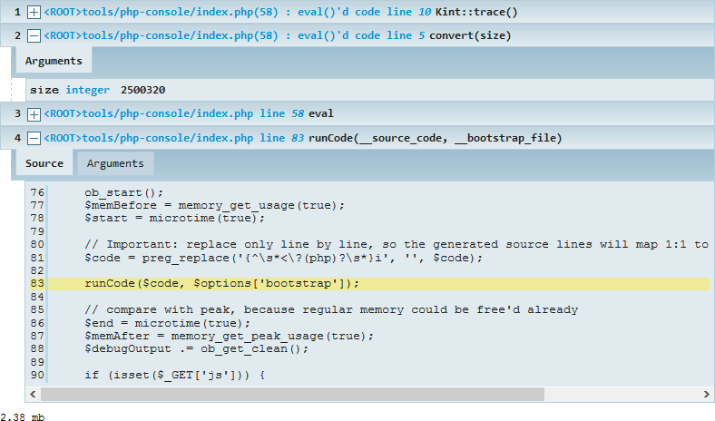

---
##Amiss
* Data mapper ORM
* Keeps its hands off your codebase - POPO
* Works well as part of a Repository pattern

.center[
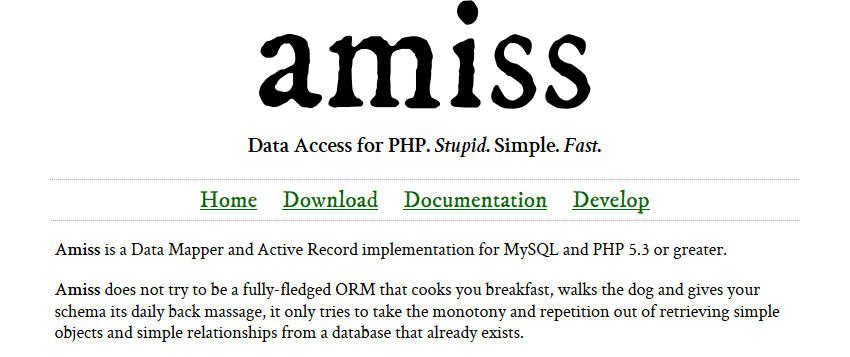
]

---
##Amiss
* Fantastic documentation - narrative and comprehensive

.center.w70[
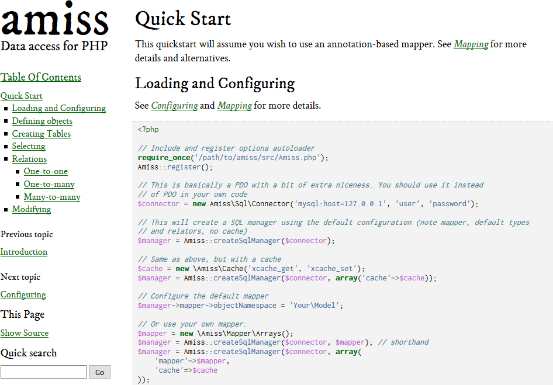
]

---
##XDebug & Webgrind
* Why is this page slow?
* XDebug extension generates profile information
* Webgrind makes the profile information browsable and understandable
* Configurable using extensions for Firefox & Chrome:

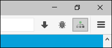
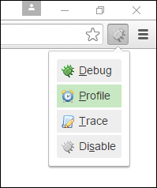

* Click the button, reload the page

---
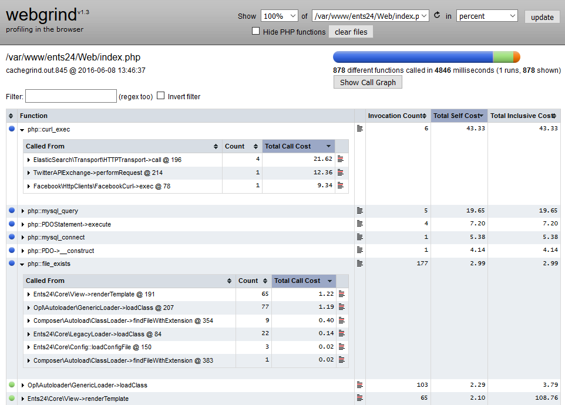

---
##XDebug & Webgrind

* `xdebug.org/docs/profiler`
* `github.com/jokkedk/webgrind`


* What about CLI scripts?

```
php -d xdebug.profiler_enable=On [script.php]
```

```
alias php-profile="php -d xdebug.profiler_enable=1"
```

---
class: center, middle
#Windows

---
##ConEmu

.center[
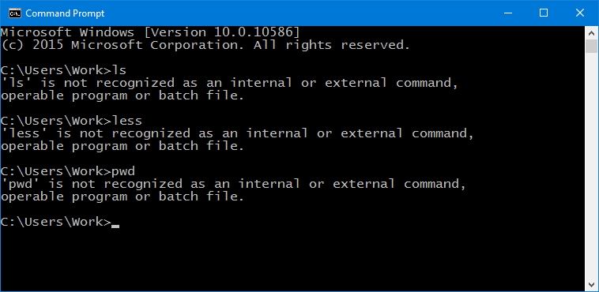
]

---
##ConEmu

.center[
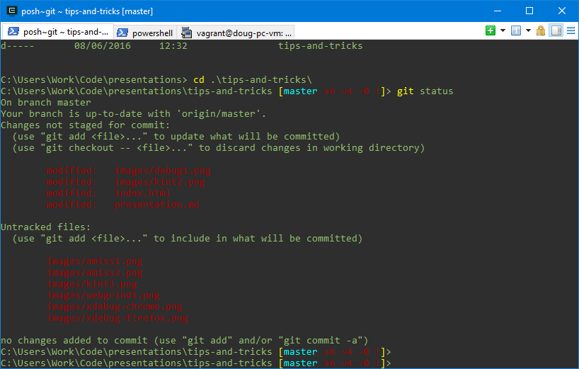
]

---
##ConEmu

.center[
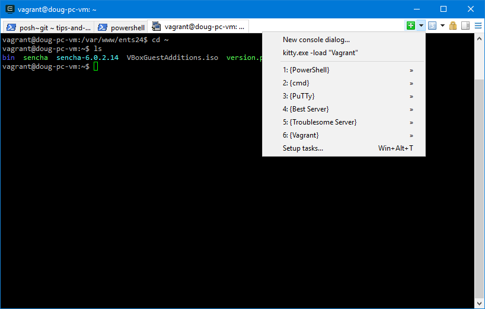
]

---
##ConEmu

* `conemu.github.io`


* Great for hosting Powershell & Cmd.exe shells

* Powershell provides aliases for common Linux command line tools - `ls` being the most helpful

* Can split into tiles windows

* Shortucts for common shell configurations - home directories / ssh sessions

* Can host some GUI applications - notepad / file explorer


---
##KiTTy

* Drop in replacement for PuTTY, everyone's favourite windows SSH client
* Adds:
    * Automatic re-connect after suspend / wakeup
    * Resizable config window
    * Folders & filters for managing large lists of hosts
    * Run local scripts & commands on servers with a keyboard shortcut

* `www.9bis.net/kitty/`

---
##Coloured SSH Terminals

* Change the background and text colour of your terminals to make it easy to know where you are

.center[
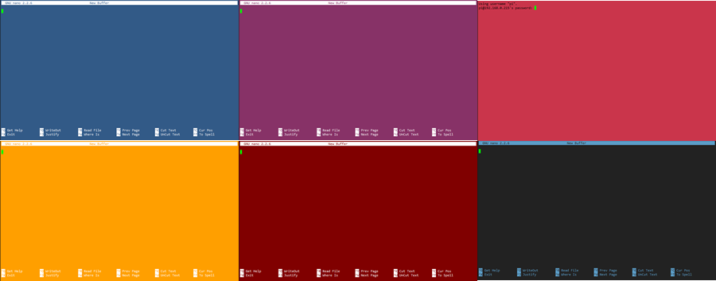
]

---
##Coloured SSH Terminals

* In PuTTY / KiTTY:

.center.w70[
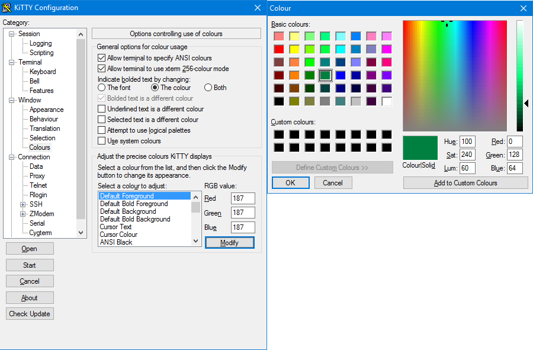
]


---
class: center, middle
#Git

* GitHub Windows / Posh Git
* Power Prompt
* Rebase -i
* share alias
* nuke alias

```
  difff    = diff -b --color-words --diff-algorithm=histogram
  share    = "!git push -u origin \"$(git rev-parse --abbrev-ref HEAD)\""
  nuke     = !sh -c 'git branch -D $1 && git branch -d -r origin/$1 && git push origin :$1' -
```

* checkout -- 
* - means "last branch"

```
git checkout master
git pull
git checkout mybranch
git rebase master
git checkout master
git merge mybranch
```

```
git checkout master
git pull
git checkout -
git rebase -
git checkout -
git merge -
```

---
class: center, middle

#Questions?