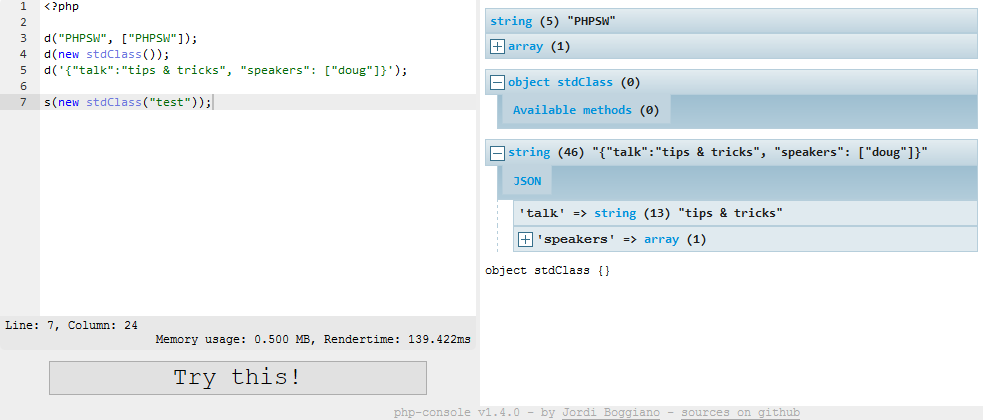

class: center, middle

background-image: url(images/crowd.jpg)


# Tips & Tricks


---
class: center, middle
#PHP

---
##Debug Console


---
##Debug Console

```php
<?php

$defaults = array(
    // how many spaces to use for indention, 0 will make it use real tabs
    'tabsize' => 4,

    // whitelist of IPs which don't need to be authenticated
    // use '*' to allow any IP
    'ip_whitelist' => array('127.0.0.1', '::1', '10.0.2.2'),

    // bootstrap file, if defined this file will be included before
    // the code entered by the user is evaluated. any variables and classes
    // defined here will be accessible by the eval'd code
    'bootstrap' => "global.php",
);
```

---
##Kint


---
##Kint


* Amiss
* XDebug profiler extension / cli
* Webgrind

---
class: center, middle
#Windows

* ConEmu
* Kitty
* Coloured Terminals

---
class: center, middle
#Git

* GitHub Windows / Posh Git
* Power Prompt
* Rebase -i
* share alias
* nuke alias

```
  difff    = diff -b --color-words --diff-algorithm=histogram
  share    = "!git push -u origin \"$(git rev-parse --abbrev-ref HEAD)\""
  nuke     = !sh -c 'git branch -D $1 && git branch -d -r origin/$1 && git push origin :$1' -
```

* checkout -- 
* - means "last branch"

```
git checkout master
git pull
git checkout mybranch
git rebase master
git checkout master
git merge mybranch
```

```
git checkout master
git pull
git checkout -
git rebase -
git checkout -
git merge -
```

---
class: center, middle

#Questions?